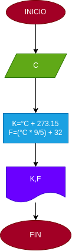

# Ejercicio N°1

## Programa para invertir una cantidad de grado C° en equivalente a K° y F°

# ANALISIS

Variables de entrada (input)

C: Grados centigrados/celcius

Variables de proceso y salida (precessing, storage, output)

F:Grados Fahrenheit

K:Grados Kelvin 

# DISEÑO

# CONTRUCCION